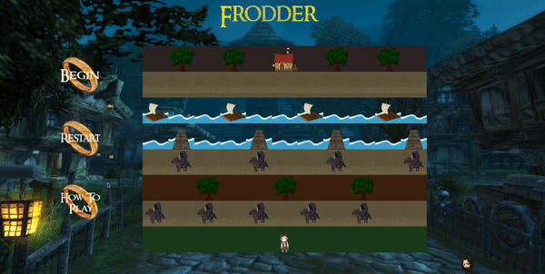
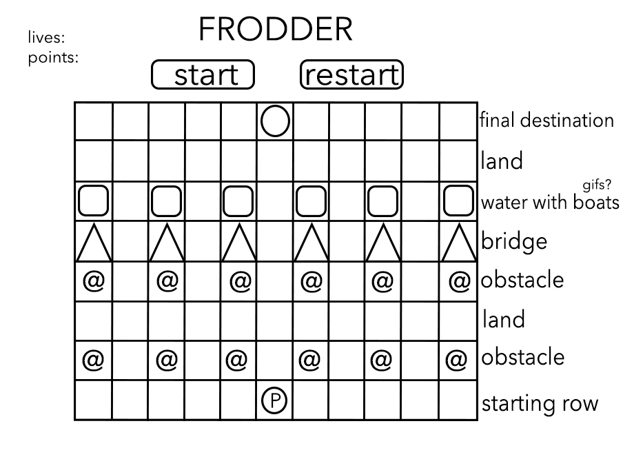

# General Assembly Project 1: Frodder

----
# Table of Contents
* Project Description
* Project Demo
* Technologies
* Process
 - Planning
 - Game
* Wins & bugs
* Extra Features
 
## Timeframe:
8 Days

## Description
Frodder is a Lord of the Rings-themed grid-based game inspired by the 1981 arcade classic Frogger. The player as Frodo must pass several rows of obstacles and try to reach the objective at the top of the grid which is 'The Prancing Pony' inn featured in the Lord of the Rings. The game is based on the Fellowship of the Ring movie sequence where Frodo, Samwise, Merry and Pippin are being chased by the Nazgûl until they reach the town of Bree to meet Gandalf at the inn.

### Deployed version:
https://justinesolano.github.io/sei-project-one/
 
## Demonstration

 
## Controls
- Click the Begin button on the side menu.
- Use the left (  ) and right (  ) arrow keys to move Frodo left and right, respectively.
- Use the up (  ) and down (  ) arrow keys to move Frodo up and down, respectively.
- Once game is finished, press Restart then Begin on the side menu.
 
## Technologies used
- HTML5 with HTML5 audio
- CSS
- JavaScript(ES6)
### Development tools:
- VSCode
- Git & GitHub
- Google Chrome development tools
- Adobe Photoshop 2021 (assets)
- Fontmeme.com
 
# PROCESS
## PLANNING (day 1)
### Concept
When starting the project, I was very worried because I didn't know where to begin. My understanding of basic JavaScript was very shaky at this point. I decided to do Frogger because the functions seemed very simple and straightforward.
 
I spent the first day writing pseudo-code and breaking down each facet of the game so I could understand what I needed to do for the project. The priority was setting up the controls for the player to move across the grid. I made sure to dedicate a few days to this before moving onto anything else complex. The second priority was the collision function between the player and the obstacles. My third priority was the obstacle movements across the grid. This would be the MVP.
 
### Storyboard/Wireframes

 
## GAME (day 2, 3, 4, 5, 6, 7)
After planning and getting signed off to start, I started with creating the grid.
```javascript
 const grid = document.querySelector('.grid')
 const length = 8
 const width = 11
 const cellCount = width * length
 const cells = []
 
 function createGrid(startPosition) {
   for (let i = 0; i < cellCount; i++) {
     const cell = document.createElement('div')
     // cell.innerText = i
     grid.appendChild(cell)
     cells.push(cell)
   }
   addFrodo(startPosition)
 }
```
Although we had a quick tutorial on grid creation before project week began, I still did not understand what the basics of this certain function did. I was very confused still about JavaScript and it definitely overwhelmed me during the first few days of the project. I was also trying to experiment with grid widths but anytime I changed it to anything over 11 cells, some rows would have more cells than others. I had to keep the width at 11 and have lesser rows and columns.
 
After, I set up the side menu quickly with the 'Begin', 'Restart' and 'How To Play' buttons. The 'How To Play' button, when hovered over, popped up with instructions in the middle of the screen.
```javascript
 // HOVER INSTRUCTIONS
 const hoverImg = document.querySelector('#how-to')
 
 hoverImg.addEventListener('mouseenter', handleMouseEnter)
 hoverImg.addEventListener('mouseleave', handleMouseLeave)
```
 
Next, I added the player to the starting position which was the middle of the bottom row. I also had to write the functions to add the player to a new cell and remove them from the old position.
```javascript
 // ADD FRODO TO GRID
 function addFrodo(position) {
   cells[position].classList.add(frodoClass)
 }
  
 // REMOVE FRODO
 function removeFrodo(position){
   cells[position].classList.remove(frodoClass)
 }
```
 
I also added the endpoint to the middle of the top row.
```javascript
 const tavern = cells[5]
 tavern.classList.add('tavern')
```
This was simple because it did not require any movement, only a win function which triggered when the player reached this cell.
 
Next, I added classes to certain cells so I could organise them into what each row would be: obstacle or safe zone.
```javascript
 // RIVER -> 22-32
 const riverElements = []
 for (let i = 22; i <= 32; i++) {
   const river = cells[i]
   river.classList.add('river')
   riverElements.push(river)
 }
 
   // ROAD -> 66-76
 const roadElements = []
 for (let i = 66; i <= 76; i++) {
   const roadOne = cells[i]
   roadOne.classList.add('road-one')
   roadElements.push(roadOne)
 }
 
   // BLACK RIDERS
 let blackRiders = [67, 69, 71, 73, 75]
 blackRiders.forEach(index => {
   cells[index].classList.add('black-riders')
 })
 
 let rafts = [23, 26, 29, 32]
 rafts.forEach(index => {
   cells[index].classList.add('raft')
 })
```
There are two rows of black rider obstacles.
 
I also created functions to add and remove rafts and black riders from each cell.
```javascript
 function addRaft(element){
   cells[element].classList.add('raft')
 }
  function removeRaft(riverElements){
   riverElements.classList.remove('raft')
 }
  // ADD POSITION OF BLACK RIDERS
 function addBlackRiders(element){
   cells[element].classList.add('black-riders')
 }
  function removeBlackRiders(roadElements){
   roadElements.classList.remove('black-riders')
 }
 // BLACK RIDERS 2
 function addBlackRiders2(element){
   cells[element].classList.add('black-riders-two')
 }
 function removeBlackRiders2(roadElementsTwo){
   roadElementsTwo.classList.remove('black-riders-two')
 }
```
 
I put each in a let variable. I used a set interval for the movement of these elements and set them to 1500 milliseconds.
```javascript
 
setInterval(() => {
   riverElements.forEach(element => {
     removeRaft(element)
   })
   if (rafts.some(element => {
     return (element + 1) % width === 0
   })){
     direction = 'left'
   } else if (rafts.some(element => {
     return element % width === 0
   })){
     direction = 'right'
   }
   rafts = rafts.map(element => {
     if (direction === 'right'){
       return element + 1
     } else if (direction === 'left'){
       return element - 1
     }
   })
   if (cells[currentPosition].classList.contains('river')) {
     resultTwo.style.opacity = '1'
     frodoFell()
     console.log('ahh')
     innAudio.pause()
     playSplash()
   }
   rafts.forEach(item => {
     addRaft(item)
     if (rafts === 32){
       rafts -= 10
     }
   })
 }, 1500)
```
This was identical for the `blackRiders` elements.
 
The main controls of the game and the collision functions were the hardest and most complex part of the project. I placed the main movements within a `startGame()` function so that the player would not be able to move until they pressed the start button.
 
Although I knew exactly what I wanted my game to do, the big problem and frustration for me was not knowing how to do it and not even knowing where to start. I received help from one of my teaching assistants because I just could not understand where the game needed to go. After it was shown to me how to achieve the key movements using conditionals, I managed to set up the simple movements for each arrow key.
Right
``` javascript
     if (key === 39 && currentPosition % width !== width - 1){
       currentPosition++
```
Left
```javascript
     if (key === 37 && currentPosition % width !== 0){
       currentPosition--
```
Up
``` javascript
     if (key === 38 && currentPosition >= width){
       currentPosition -= width
```
Down
``` javascript
     if (key === 40 && currentPosition + width <= width * length - 1){
```
 
I actually understood the way the specified conditions worked but doing the math to write them did take a bit of time.
 
Once the movements were set up, I needed to work on the collision function. I used nested conditionals with each arrow movement to do this. Everytime the player's current position contains the class names of 'river, 'river-two', 'black-riders' or 'black-riders-two', this called the `frodoFell()` function variable
```javascript
 function frodoFell(){
   removeFrodo(currentPosition)
 }
```
 
Most of the obstacles were set up and moving by day 5 at which point I felt more comfortable coding. Before the project, I was very stressed about having to write JavaScript and do the project because it all seemed very complicated and beyond my skills at the time. However, it was during day 4/5 that I took an hour to review the code to see whether I knew what was going on and it was then when I miraculously began to understand more about JavaScript basics. I reached my MVP by day 6.
 
During day 7, I decided to add some extra hurdles to the game. I added trees to the first empty road in the grid to block the player's way and make the game harder. I also added trees to the top row beside the Prancing Pony Inn to make the game look nicer. I created a function for all the trees and each arrow movement:
```javascript
   // FRODO CANNOT WALK INTO TREES
   function noUpTree(){
     currentPosition += width
   }
    function noDownTree(){
     currentPosition -= width
   }
    function noLeftTree(){
     currentPosition -= 1
   }
    function noRightTree(){
     currentPosition += 1
   }
```
These functions were called in a nested conditional within the specific arrow movement functions. For example, the noLeftTree function was called in the left arrow movement function etc.
```javascript
       } else if (cells[currentPosition].classList.contains('trees')){
         noLeftTree()
       } else if (cells[currentPosition].classList.contains('trees-two')){
         noLeftTree()
       }
```
 
I managed to set these up on my own. Because I had asked for help everyday of the project up until this point, not needing to consult with the instructional team about every little thing did help me feel more optimistic with basic JavaScript. In hindsight, the tree collision functions are simple but during the project, it seemed more complex and realising I could work it out on my own was a big confidence boost.
 
I also added a game track which plays when the startGame button is pressed. When Frodo collides with a black rider, the sound of a Nazgûl screech plays. When Frodo falls into the river, a splash sound plays. When Frodo reaches the inn, a sound of a cheer plays which I cut from a scene from Return of the King from just before the Rohirrim charge onto Pelennor Fields.
 
### Styling (day 7 & 8)
I started properly styling during day 7. Most of the assets had been created during the process because I needed to have the pictures of the obstacles ready so I could use them during code-testing. I created the 'Frodder' title on Fontmeme.com. The background image used is of a 3D medieval town with a pub/inn in the center. This was to tie together the goal of the game which is to reach the Prancing Pony Inn at the top.
 
The 'Begin', 'Restart', and 'How To Play' text were created on Fontmeme.com also. I then used Photoshop to place them on top of the ring to use as buttons for the menu. As an extra mini feature, I placed a mini cartoon of Aragorn on the bottom-right of the screen.
 
The hover instructions were difficult to place in the middle of the screen and stay there whenever the screen resizes. It is not responsive.
 
## Wins, hurdles and unsolved problems
### Wins:
The biggest win from this project is definitely understanding way more about JavaScript in a week than I thought I would. I was very pessimistic about how much the project would actually help with this and I felt a lot of frustration with having to do independent coding so soon. By the last few days, I really understood a lot of what I had coded. I understood the necessity of variables, when to use const and let, the way conditionals worked, and the usefulness of query selectors.
 
I definitely feel that the project helped consolidate a lot of what we had learned prior because I got to apply the knowledge myself. I felt very appreciative for the experience of struggling, working through problems, and coming out more self-assured and excited to learn more.
 
### Hurdles:
The biggest hurdle was the image of Frodo overtaking each cell whenever the player moved into it. For example, the image used for the road would disappear when Frodo moved into it. Because the image is a png, only Frodo would appear in the cell and the background would be transparent. This also applied to the png of the black riders as they were on the same rows as the road. I managed to fix this with a long solution which was to place the black rider png on top of the image of the road so whenever they moved, there would be a road in the background also. I did this with the Frodo png for the road, the bridge, the raft and the Prancing Pony Inn gif.
 
### Unsolved problems:
There is one big issue with the game. The solution I input above with the Frodo png only works when the player uses the up and down movement keys and not for the left and right keys. When using the left and right keys, the image of Frodo does not get removed from the previous cell so two Frodos appear in the grid. I only had time to apply this solution to the up and down keys and not enough time to figure out how to solve this for the right and left keys.
 
#### Demonstration of bug

 
## Extra features/improvements
- Finding a solution to the duplicating Frodo bug
- Responsive hovered instructions
- Having the obstacles loop around each row and not just moving back and forth
- Timer
- Scoring points each row that is passed
 

